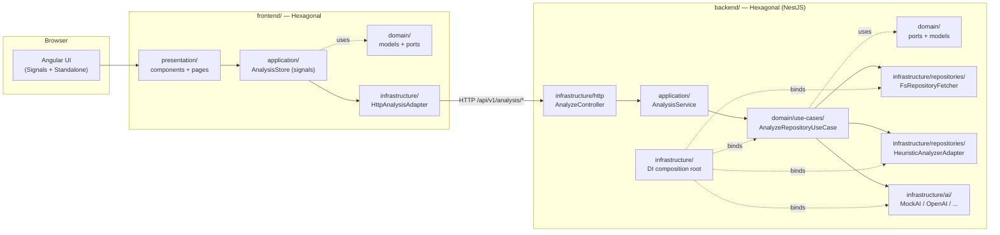

# Code Insight AI — Fullstack Cloud Challenge 🚀

> Automated reverse engineering of source repositories.
> Built with **Angular 17** + **NestJS 10** following a **Hexagonal Architecture**
> in both the frontend and the backend.


## ✨ What it does

1. Accepts a **public Git URL** or a **ZIP upload** of a repository.
2. Clones / extracts the project into a sandboxed temp directory.
3. Runs **static analysis** to infer language, framework, components,
   APIs consumed and the **architectural pattern** (Hexagonal, Clean, MVC,
   Microservices, N-Layer, Monolith).
4. Calls a **pluggable AI port** (`mock` by default, swap for OpenAI/Gemini/
   Anthropic/Ollama/Bedrock) for a human-friendly functional summary.
5. Surfaces **findings & recommendations** (secrets, no-tests, missing README,
   no error handling, …) through a clean Angular UI.

## 🏛 Architecture at a glance



**Key invariant**: domain layers have **no** knowledge of HTTP, NestJS,
Angular or any AI SDK. Everything flows through `ports (interfaces)` defined in
the domain.

## 🧱 Repository layout

```
prueba-Fullstack-Cloud/
├── .github/
│   ├── workflows/ci.yml          # CI: backend (Jest + nest build) + frontend (ng build)
│   ├── ISSUE_TEMPLATE/           # bug_report, feature_request
│   └── pull_request_template.md
├── agent_definition.md           # Profile of the AI agent that built this
├── backend/                      # NestJS 10 + TypeScript (hexagonal)
│   ├── src/
│   │   ├── domain/               # Models, ports, use cases (PURE)
│   │   ├── application/          # AnalysisService
│   │   └── infrastructure/       # Controllers, AI adapters, analyzers, DI wiring
│   ├── test/                     # Jest specs (use case, mock AI, heuristic analyzer)
│   ├── Dockerfile
│   └── package.json, tsconfig.json, nest-cli.json, .env.example, README.md
├── frontend/                     # Angular 17 standalone + signals (hexagonal)
│   ├── src/app/
│   │   ├── domain/               # Pure models & ports
│   │   ├── application/          # Signal-based store
│   │   ├── infrastructure/       # HttpAnalysisAdapter
│   │   └── presentation/         # Standalone components & pages
│   ├── Dockerfile, nginx.conf
│   └── package.json, angular.json, tailwind.config.js, proxy.conf.json, README.md
├── docker-compose.yml            # `docker compose up --build` → http://localhost:8080
├── .gitignore
└── README.md                     # ← you are here
```

## ⚡ Quick start

### Option A — Local (Node.js)

Prerequisites: Node 20+, npm 10+, Git.

```bash
# 1) Backend
cd backend
cp .env.example .env
npm install
npm run start:dev            # http://localhost:3000/api/docs

# 2) Frontend (in a second terminal)
cd frontend
cp .env.example .env
npm install
npm start                    # http://localhost:4200
```

### Option B — Docker Compose (zero local installs)

```bash
docker compose up --build
# Frontend → http://localhost:8080
# Backend  → http://localhost:3000/api/docs
```

Set `OPENAI_API_KEY` and `AI_PROVIDER=openai` in your shell (or a `.env` next
to `docker-compose.yml`) before starting to use a real AI provider.

## 🤖 Switching the AI provider

The `AI_PROVIDER` env variable chooses which `IAISummaryPort` implementation is
wired at the composition root (`backend/src/infrastructure/ai/ai.module.ts`):

| Provider               | Status               | How to enable                                            |
|------------------------|----------------------|----------------------------------------------------------|
| `mock`                 | ✅ active (default)  | No setup, deterministic, offline                         |
| `openai`               | ✅ wired             | `AI_PROVIDER=openai` + `OPENAI_API_KEY=sk-...`            |
| `gemini`               | ⬜ plug-in           | Drop a `GeminiAdapter` and add a `case 'gemini':` branch |
| `ollama`               | ⬜ plug-in           | Set `OLLAMA_BASE_URL=http://localhost:11434`             |
| `anthropic`, `bedrock` | ⬜ plug-in           | Follow the same pattern                                  |

The domain layer **never changes** when swapping providers — that's the whole
point of the hexagonal split.

## 🧪 Tests

```bash
cd backend
npm test                     # 7 specs (use case + mock AI + heuristic analyzer)
```

A **GitHub Actions** workflow (`.github/workflows/ci.yml`) runs these checks on
every push and PR:

- `tsc --noEmit` (backend + frontend)
- `nest build` (backend)
- `ng build --configuration=production` (frontend)
- `jest --runInBand` (backend)

## 🛡 Security

Following the bank restrictions:
- Only **public** GitHub HTTPS URLs are accepted.
- No credentials/secrets ever hardcoded — see `.env.example`.
- `.gitignore` excludes `.env`, `node_modules/`, `dist/`, `tmp/`, `coverage/`.
- CI never logs API keys.
- Heuristic analyzer flags hardcoded secrets as `CRITICAL` findings.

## 📦 What's NOT in scope (4-hour MVP)

- Real OpenAI SDK call works (default `gpt-4o-mini`), but it was tested
  without a live key (placeholder fallback).
- Authentication / multi-tenant.
- Persistent storage (PostgreSQL was avoided to keep the bootstrap self-contained).
- Production AWS deployment — but `docker-compose.yml` and the Dockerfiles
  show the **Opción B** deployment shape described in the challenge PDF.

## 📜 License & ethics

This challenge was developed for the **Code Insight AI: Ingeniería Inversa
Automatizada de Repositorios** kata. No bank internal code, no proprietary
repositories and no real secrets have been used.